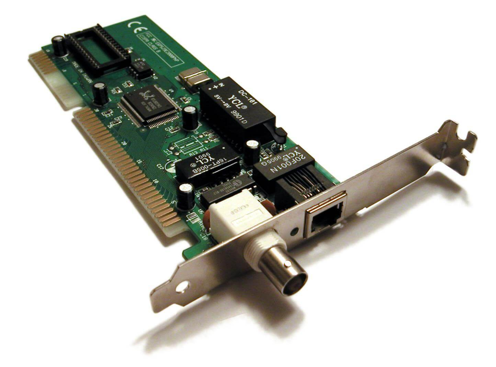

### Network 1 : Lab #1
### By Ahmed Arafat (Ahmed Mohamed Yousry)

### What is Network ?!
- A network is the connection between two or more computers or any other electronic
devices so that they can exchange data

- a network allows:
  1. Computers to share files
  2. Users to messages & email each other
  3. Share resources (like using one printer in the same room across multiple users)

- Network connection between devices are typically created using cables(wire),
however, connections can be created using radio signals (wireless/Wi-Fi) or even for 
very long distance via satellite links

### Why We Need Network ?
- Sharing data through the use of floppy disks is not an efficient or cost-effective manner.

- Businesses needed a solution that would successfully address the following three problems:
  - How to avoid duplication of equipment and resources
  - How to communicate efficiently
  - How to set up and manage a network

- Businesses realized that networking technology could increase productivity while saving money.

### Devices Network
- Switch
- Hub
- Router
- Bridge
- File Server
- PC/Laptop

### NETWORK DEVICES
- Equipment that connects directly to a network segment is referred to as a device.

- These devices are broken up into two classifications.
  - End-user devices : include computers, printers, scanners, and other devices that provide services directly to the user.
  - Network devices : include all the devices that connect the end-user devices together to allow them to communicate.

- Network
  - Devices
    - End Devices
    - Infrastructure Devices
  - Media
    - Cables

#### Cables In A Network:
- UTP Cable (unshielded twisted-pair cable) : is a type of cabling that 
is used for telephone communications and most modern Ethernet networks. 
- A pair of wires forms a circuit that can transmit data. 
The pairs are twisted to provide protection against crosstalk, the noise 
generated by adjacent pairs. When electrical current flows through a wire,
it creates a small, circular magnetic field around the wire.
- UTP cable often is installed using a Registered Jack 45 (RJ-45) connector, the RJ-45 is an eight-wire connector used commonly to connect computers onto a local-area network (LAN), especially Ethernets.

  
UTP Cable

 
STP Cable

 
RJ-45 connector

- Commonly used types of UTP cabling are as follows:
  - Category 1: Used for telephone communications. Not suitable for transmitting data.
  - Category 2: Capable of transmitting data at speeds up to 4 megabits per second (Mbps).
  - Category 3: Used in `10BASE-T` networks. Can transmit data at speeds up to 10 Mbps.
  - Category 4: Used in Token Ring networks. Can transmit data at speeds up to 16 Mbps.
  - Category 5: Can transmit data at speeds up to 100 Mbps.
  - Category 5e: Used in networks running at speeds up to 1000 Mbps (1 gigabit per second [Gbps]).
  - Category 6: Typically, Category 6 cable consists of four pairs of 24 American Wire Gauge (AWG) copper wires. Category 6 cable is currently the fastesta standard for UTP.

 
10BASE-T Cable

LAN: Networks are often called LANs, short for local area network.  

On the network: Every computer connected to the network is said to be “on
the network.” The technical term (which you can forget) for a computer
that’s on the network is a node. 

» Online, offline: When a computer is turned on and can access the network,
the computer is online. When a computer can’t access the network, it’s
offline. A computer can be offline for several reasons. The computer can be
turned off, the user may have disabled the network connection, the computer
may be broken, the cable that connects it to the network can be unplugged,
or a wad of gum can be jammed into the disk drive. 

» Up, down: When a computer is turned on and working properly, it’s up.
When a computer is turned off, broken, or being serviced, it’s down. Turning
off a computer is sometimes called taking it down. Turning it back on is
sometimes called bringing it up. 

» Local, remote: A resource such as a disk drive is local if it resides in your
computer. It’s remote if it resides in another computer somewhere else on your network.  

» Internet: The Internet is a huge amalgamation of computer networks strewn
about the entire planet. Networking the computers in your home or office so
that they can share information with one another and connecting your
computer to the worldwide Internet are two separate but related tasks. 

### Overview of Network Components

 
Simple Computer Network

`Client`: The term client defines the device an end user uses to access
a network. This device might be a workstation, laptop, smartphone 

`Server`: A server, as the name suggests, serves up resources to a
network. These resources might include email access as given by an email server
, web pages as offered by a web server, or files available on a file server. 

`Hub`: A hub is an older technology that interconnects network
components, such as clients and servers. Hubs vary in their number of
available ports. However, for scalability, you can interconnect hubs,
up to a point. If you chain too many hubs together, network errors can
result. A hub is a Layer 1 device and does not perform any inspection of the
traffic it passes. Rather, a hub simply `receives` traffic in a port (that is,
a receptacle to which a network cable connects) and `repeats` that traffic
out **all** the other ports. Remember, for the local area network (LAN),
the hub is considered obsolete

 
A Hub

`Switch`: Like a hub, a switch interconnects network components, and
switches are available with a variety of port densities. However, unlike
a hub, a switch does not simply take in traffic on one port and blast
that traffic out all other ports. Rather, a switch learns which devices
live off which ports. It does this by inspecting traffic that comes into
the port (inbound) and recording the source address. It then looks at
the destination address and, if the switch knows the destination
address, it forwards the traffic out of the appropriate port, not out of
all the other ports.  
This dramatically cuts down on the volume of traffic coursing through
your network. Consider a switch a Layer 2 device, which means that
it makes its forwarding decisions based on addresses that are
physically burned into a network interface card (NIC) installed in a host
(that is, any device that transmits or receives traffic on a network).  

This burned-in address is a `Media Access Control (MAC) address`
An example of a MAC address is:`00-B0-D0-63-C2-26`

  
A Switch

`Router`: consider a router to be a Layer 3 device, which means that it
makes its forwarding decisions based on logical network addresses.
Most modern networks use Internet Protocol (IP) addressing.
Therefore, most routers know what logical IP networks live off which
router interfaces. Then, when traffic comes into a router, the router
examines the destination IP address of the traffic and, based on the
router’s database of networks (that is, the routing table), it intelligently
forwards the traffic out the appropriate interface.

  
A Router

`Media`: The previously mentioned devices need to be interconnected
via some sort of media. This media could be copper cabling. It could
be a fibre-optic cable. Media might not even be a cable, as is the case
with wireless networks, where radio waves travel through the media
of air. For now, realize that media varies in its `cost`, `bandwidth`
capacity, and `distance` limitation.

For example, although fibre-optic cabling is more expensive than
unshielded twisted-pair cabling, it can typically carry traffic over
longer distances and has a greater bandwidth capacity (that is, the
capacity to carry a higher data rate).

» Network interface: Inside any computer attached to a network is a special
electronic circuit called the `network interface card (NIC)`. The network interface has
either an external jack into which you can plug a network cable — or, in the
case of a wireless network interface, an antenna.  

 
Network Interface Card (NIC)

