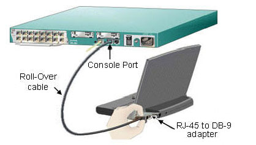
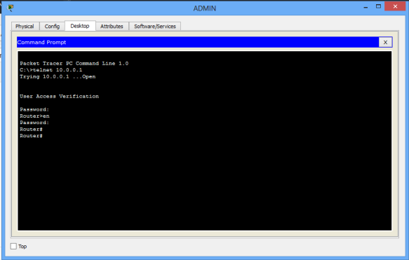
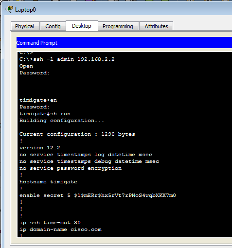
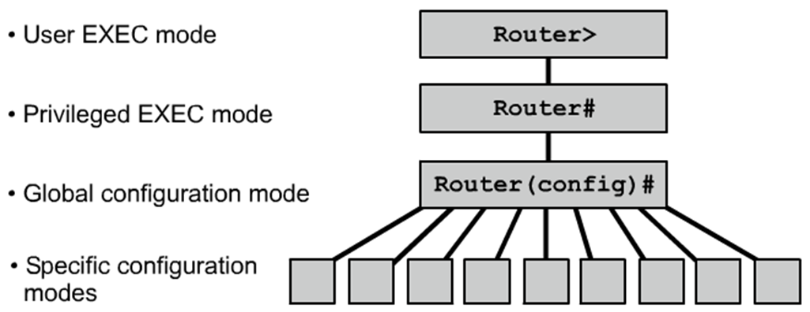
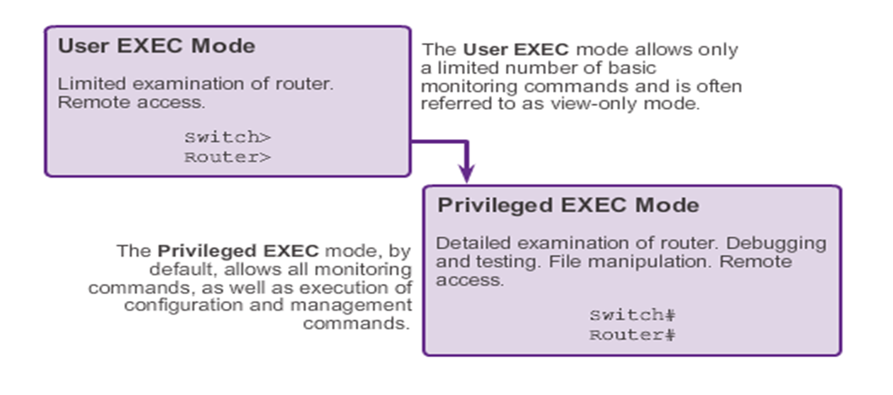
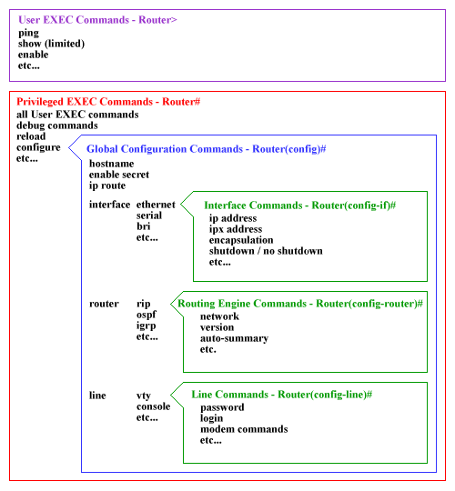

### Network 1 : Lab #2
### By Ahmed Arafat (Ahmed Mohamed Yousry)

### IP Address
- An IP address is a unique address that identifies a device on the internet or a local network. 
- IP stands for "Internet Protocol," which is the set of rules governing the format of data sent via the internet or local network.
- In essence, IP addresses are the identifier that allows information to be sent between devices on a network: they contain location information and make devices accessible for communication. 
- The internet needs a way to differentiate between different computers, routers, and websites. IP addresses provide a way of doing so and form an essential part of how the internet works.
- The 32-bit IP Address groups 8 bits a time
- Each group of 8 bits is an octet
- Each of the four `octet` are separated by dot

- It consists of four parts `xxx.xxx.xxx.xxx`, each part (`xxx`) is 8 bits (1 byte), so 8*4 = 32 bites (4 bytes)
- Every part is called as we said `octet`

- We can specify the class range of an IP Address by observing the first octet
````
Class	        Range	    Network Address           Host Address
A       	0-127	           xxx                xxx.xxx.xxx
B	       128-191	         xxx.xxx               xxx.xxx
C	       192-223          xxx.xxx.xxx              xxx
````
> This classification depends on the network size & structure, let's observe the
> class `C` has only host address that range from 0 to 255 devices in that network,
> while Class `B` has a 256 * 256 = 65,536 devices in that network

- Let's see an example
````
192.168.7.15 class `C` (192.168.7) (15)
192 refers to ISP (Internet service provider)
168 refers to Organization (BIS HU - CIC Zayed - AUC - GUC)
7 refers to LAN number (Lab Number)
15 refers to the device number connected in this `LAN`
````
> If I have a WE internet, in Banque Masr, in IT Department, the device number 9 connected to the network.
> What will be the IP Address

- Test your Knowledge, specify the class of each of the following `IP Address`
````
1.2.3.4
191.222.222.1
192.168.1.1
````
> Answer: `A`,`B`,`C` respectively

- We will see later that we can connect devices on the same network address using `switchs`
- While we can connect devices on different network address using `routers`


- For class `C` the `subnet mask` is `255.255.255.0`, for class `A` `subnet mask` is `255.0.0.0`


### Switch Access Modes
1. Console
2. Telnet
3. Secure Shell (SSH)


1. Console (SWITCH CONSOLE PORT)
   - There are many ways to control Cisco devices. Some of them are for remote access ( like telnet, ssh etc. ) but what if your remote access is down ? You need to connect the device again ! This is why we need console port.
   Console port of a switch or a router provides connection when you are at the same physical location with the device. You plug the console cable to the console port of the device and you can connect the IOS by this way.<br>
     
   
2. Telnet
   - Method for remotely accessing the CLI over a network
   Require active networking services and one active interface that is configured 
   - Telnet is a network protocol that allows a user to communicate with a remote device. It is a virtual terminal protocol used mostly by network administrators to remotely access and manage devices. Administrator can access the device by telnetting to the IP address or hostname of a remote device. 
   - To use telnet, you must have a software (Telnet client) installed. On a remote device, a Telnet server must be installed and running. Telnet uses the TCP port 23 by default.
   - One of the greatest disadvantages of this protocol is that all data, including usernames and passwords, is sent in clear text, which is a potential security risk. This is the main reason why Telnet is rarely used today and is being replaced by a much secure protocol called SSH. <br>
   
3. SSH
   - Remote login similar to Telnet but utilizes more security Stronger password authentication Uses encryption when transporting data
   - SSH is a network protocol used to remotely access and manage a device. The key difference between Telnet and SSH is that SSH uses encryption, which means that all data transmitted over a network is secure from eavesdropping. SSH uses the public key encryption for such purposes.
     Like Telnet, a user accessing a remote device must have an SSH client installed. On a remote device, an SSH server must be installed and running. SSH uses the TCP port 22 by default. <br>
     


### Cisco IOS 
- IOS stands for The Internet working Operating System (IOS) is a family of network operating systems used on several `router` and network `switch` models manufactured by `Cisco` Systems.
- Cisco IOS has a `Command Line Interface (CLI)` and it has three command line modes. Each mode has access to different set of IOS commands.






- `User mode (User EXEC mode)` 
  - After you access the device, you are automatically in user EXEC command mode.
  - The EXEC commands available at the user level are a subset of those available at the privileged level.
  - In general, use the user EXEC commands to temporarily change terminal settings, perform basic tests, and list system information.
  - The supported commands can vary depending on the version of software in use.
  - To display a comprehensive list of commands, enter a question mark (?) at the prompt
````
Router>
````

- `Privileged mode (Privileged EXEC Mode)`
  - Because many of the privileged commands configure operating parameters, privileged access should be password-protected to prevent unauthorized use.
  - The privileged command set includes those commands contained in user EXEC mode, as well as the configure privileged EXEC command through which you access the remaining command modes.
  - If your system administrator has set a password, you are prompted to enter it before being granted access to privileged EXEC mode.
  - The password does not appear on the screen and is case-sensitive.
  - The privileged EXEC mode prompt is the device name followed by the pound sign (#).
````
Router#
````

- `Global Configuration mode`
  - Global Configuration mode allows users to modify the running system configuration. 
  - From the Privileged mode a user can move to configuration mode by running the "configure terminal" command from privileged mode. To exit configuration mode, the user can enter "end" command or press Ctrl-Z key combination.
````
Router(config)#
````


## The Question Here, Should We Buy These Expensive Hardware Devices To Learn How To Use It ??
- The solution is in `Cisco Packet Tracer`, you don't have to buy fancy & expensive
routers,switches,wires and so on
- All you have to do is to use Cisco's free software
- Packet Tracer is a cross-platform visual simulation tool designed by Cisco Systems that allows users to create network topologies and imitate modern computer networks. The software allows users to simulate the configuration of Cisco routers and switches using a simulated command line interface.


<hr>

### Extra 
<hr>

### Question Is Asked On Quora
`Q`: IP address has total combinations of 256^4, what if number of users and servers exceed this limit? Explain precisely how they're assigned? 

`A` : IPv4 addresses - the ones that are 4 bytes long - would have long ago run out if not for a trick: Certain ranges of addresses - 10.x.y.z, 172.16–31.x.y, and 192.168.x.y - were reserved as “private” and “non-routable.” That is, they cannot appear out on the greater Internet. Instead, they can be reused for multiple machines. So the machine I’m typing this on is using IP address 10.0.1.32 - and there are likely tens of thousands of other machines out there that use the same private address.

So how do I communicate with others, and how do they communicate with me? Using a mechanism called NAT, or Network Address Translation. My ISP, Frontier, assigns me a single public, routable address - at the moment it’s 32.213.39.212, though this is subject to change. “Behind” that address are all my hosts, at their local 10.* addresses. My Internet router keeps track of connections and knows that the connection I’m using to type this should be re-routed to my machine, rather than one of the others on the network.

NAT has enabled IPv4 to support and Internet way larger than anyone considered likely even when the address structure was defined. But even NATed IPv4 is becoming untenable. There as some hacks that have been used to extend its life a bit - e.g., doing a second level of NAT inside the ISP’s, so that I might actually share my external IP with someone else, with the ISP keeping our traffic flows separate. But the real solution is IPv6, which uses 128 bit addresses - way more than could ever be assigned. But cutting over has proven to be a much longer process than anyone thought. IPv6 is widely, probably universally, supported in Internet backbones, and by larger sites. These days, when you connect to a larger site, you’re almost certainly using IPv4 “tunneled through” IPv6 much of the way. But it’ll take many years before all IPv4 usage disappears - and you’ll like see homes and smaller businesses continuing to use the old IPv4 private addresses for their internal networks indefinitely.
